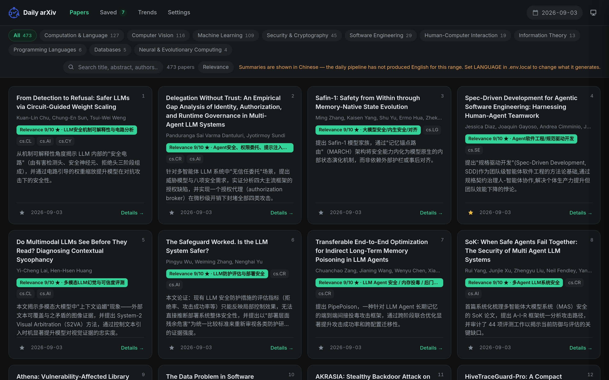
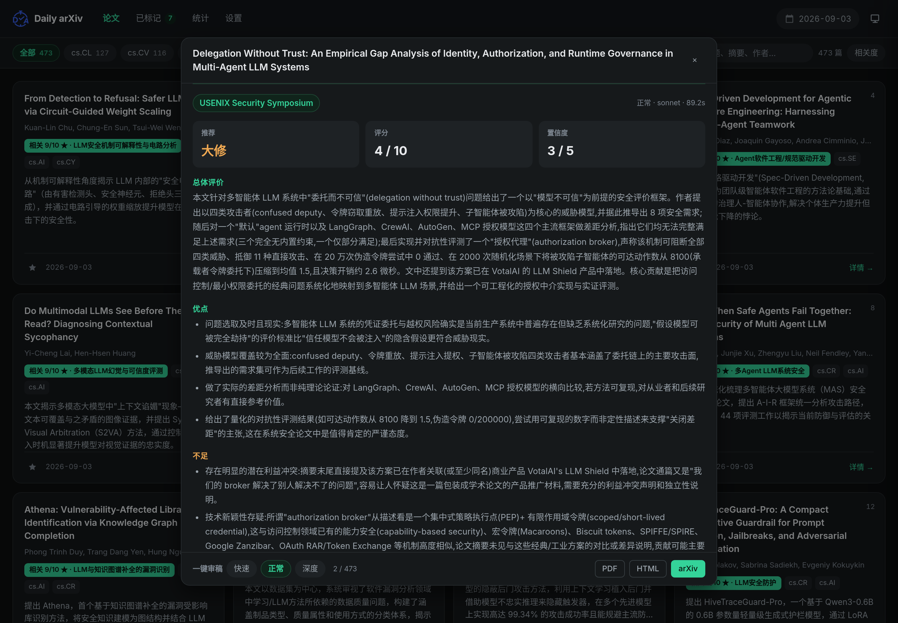
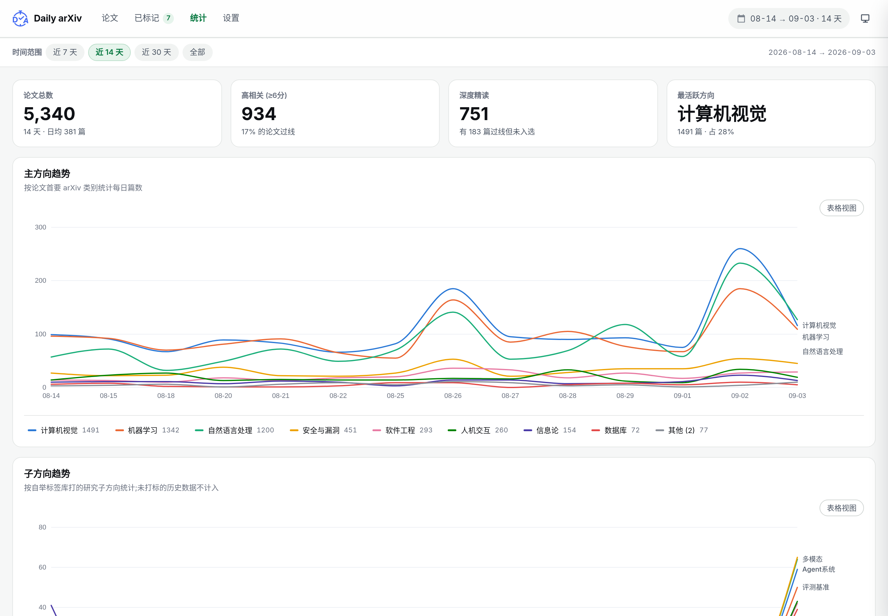
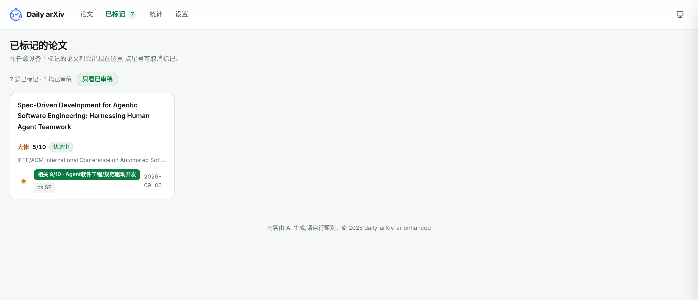
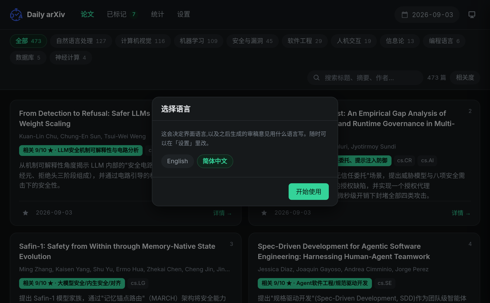
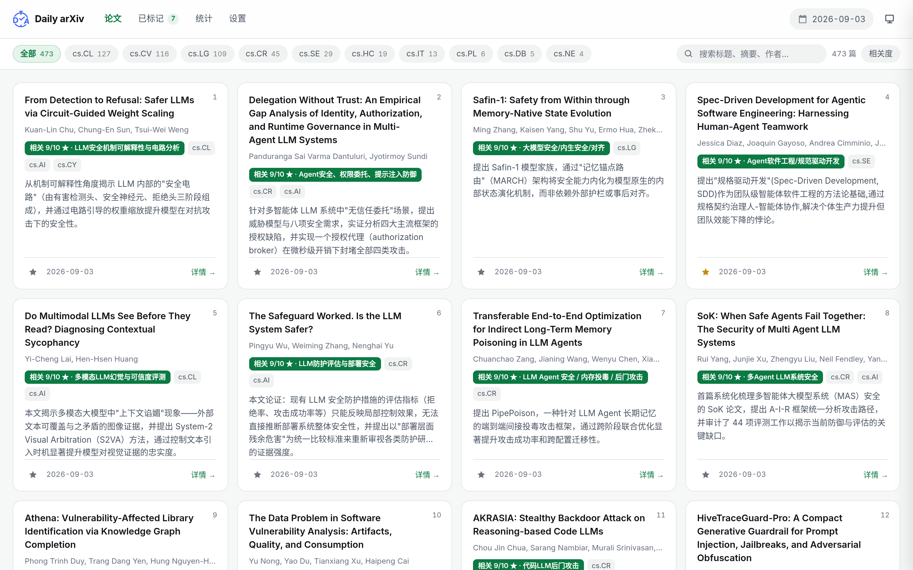
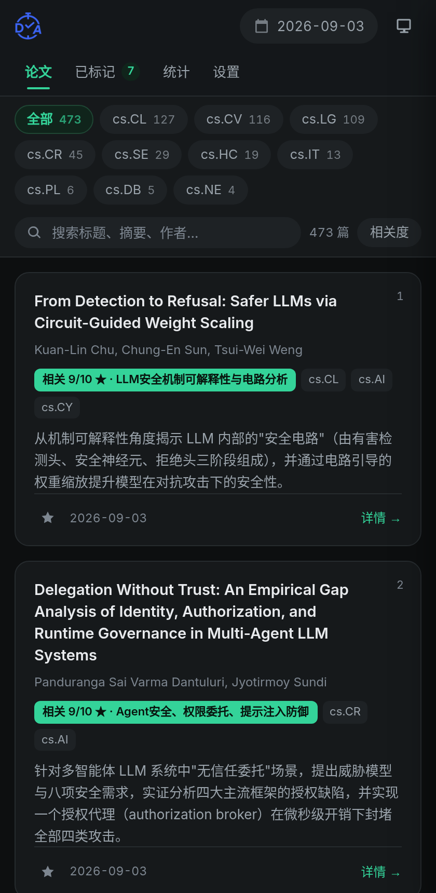

<div align="center">

# Daily arXiv AI Enhanced · Self-hosted

**Track arXiv daily. Summarize, rank and review papers with *your own*
Claude Code / Codex CLI — no third-party API key required.**

[简体中文](./README.zh-CN.md) · **English** · [Full Guide](./docs/GUIDE.md)

</div>

---

<div align="center">

</div>

---

## What this is

Upstream [dw-dengwei/daily-arXiv-ai-enhanced](https://github.com/dw-dengwei/daily-arXiv-ai-enhanced)
runs on GitHub Actions with a third-party LLM API key. This fork rewires it to
**local cron + local CLI**: it drives the **Claude Code** or **Codex** CLI you have
already logged into, using your own subscription quota. No API key to obtain,
and every paper and review stays on your machine.

| | Upstream | This fork |
|---|---|---|
| Runtime | GitHub Actions | local cron |
| Model | DeepSeek / OpenAI API key | your logged-in Claude Code or Codex |
| Cost | pay per token | your existing subscription, no API key |
| Frontend | multi-page | single-page app, no reload between views |
| Ordering | by category | ranked 0–10 against *your* research focus |
| Extras | — | one-click review, cross-device bookmarks, trend charts, dark mode |

## Features

### Relevance ranking, not a category dump

Write your research directions in `ai/research_focus.txt` — it is the *sole* basis
for scoring. Every paper gets a 0–10 score and a full five-section summary from the
fast model; those above the threshold and in the day's top-K get rewritten by the
strongest model. Edit the file and the next run picks it up — no code changes.

### One-click review

<div align="center">

</div>

Two stages: a fast model picks the most likely venue from a fixed whitelist
(NDSS / USENIX Security / ICSE / NeurIPS …), then **Quick / Normal / Deep**
selects the model that writes the review as a reviewer *for that venue* — summary,
strengths, weaknesses, detailed comments, questions to the authors, rating,
recommendation and confidence.

The tiers genuinely differ. On the same paper the fast model returned
"Minor revision, 8/10" while the mid tier returned "Major revision, 4/10" and
questioned a specific latency claim against the typical latency of comparable
policy engines.

### Trends

<div align="center">

</div>

Daily trends for primary categories, sub-directions and keywords. A crosshair reads
out every series at once, the legend toggles series on and off, and a table view is
one click away. Sub-direction labels are bootstrapped: the model reuses existing
labels and only creates a new one when nothing fits.

### Bookmarks × review verdicts

<div align="center">

</div>

Bookmarks and reviews live in one sqlite file, so the bookmark list shows the
recommendation, rating and venue inline instead of making you open each paper.
There is a "reviewed only" filter.

### Interface language

<div align="center">

</div>

On first run the app asks which language you want, and remembers it. Change it any
time under **Settings → Language**. The choice drives three things, which take
effect differently:

| What | When it changes |
|---|---|
| Interface text | immediately |
| New reviews | the next review you run is written in that language |
| Paper summaries | fixed when the daily pipeline generated them |

Summaries are the one that cannot change retroactively — they were written by the
pipeline at crawl time. If the language you picked has no summaries for the range
you are looking at, the app says so and tells you which `LANGUAGE` to set in
`.env.local`. Existing reviews are kept in the language they were written in
rather than being re-translated.

### Dark mode · works on phones

<div align="center">


</div>

Black/white/green palette, following the system or toggled manually. The theme is
applied before first paint, so dark-mode users never see a white flash.

## Quick start

```bash
# 1. Install and log into one CLI
npm i -g @anthropic-ai/claude-code && claude     # https://claude.com/claude-code
# or
npm i -g @openai/codex && codex login            # https://developers.openai.com/codex/cli

# 2. Install
git clone https://github.com/springkill/daily-arXiv-ai-enhanced.git
cd daily-arXiv-ai-enhanced
python3 -m venv .venv && source .venv/bin/activate && pip install -e .

# 3. Configure
cp .env.local.example .env.local && $EDITOR .env.local
cp ai/research_focus.example.txt ai/research_focus.txt && $EDITOR ai/research_focus.txt
python3 ai/llm.py "reply with exactly: OK"       # smoke-test the CLI

# 4. Run
./run-local.sh
python3 -m http.server 8000                      # http://localhost:8000
```

Bookmarks and reviews need the backend (optional — everything else works without it):

```bash
ln -sf "$PWD/deploy/api/arxiv-api.service" ~/.config/systemd/user/
systemctl --user daemon-reload && systemctl --user enable --now arxiv-api
```

For production deployment see **[SELF-HOSTED.md](./SELF-HOSTED.md)**;
for how it works and every config knob see **[docs/GUIDE.md](./docs/GUIDE.md)**.

## Where your data lives

`data/` (daily jsonl), `var/store.sqlite3` (bookmarks + reviews), `.env.local`,
`ai/research_focus.txt` and `assets/trend-taxonomy.json` are **all gitignored** —
the repository ships only `.example` / `.seed` templates and contains nobody's
personal data.

> [!CAUTION]
> If your jurisdiction has censorship requirements for academic data, run this code
> with caution; any redistributed version must fulfil its content review obligations
> (including but not limited to the compliance of the original papers and of AI
> output), otherwise all legal consequences are borne by the downstream party.

---

## Contributors

Most of this project's functionality comes from upstream
[dw-dengwei/daily-arXiv-ai-enhanced](https://github.com/dw-dengwei/daily-arXiv-ai-enhanced).
Thanks to the following contributors of the original project for contributing code,
discovering bugs, and sharing useful ideas:
<table>
  <tbody>
    <tr>
      <td align="center" valign="top">
        <a href="https://github.com/JianGuanTHU"><br /><sub><b>JianGuanTHU</b></sub></a><br />
      </td>
      <td align="center" valign="top">
        <a href="https://github.com/Chi-hong22"><br /><sub><b>Chi-hong22</b></sub></a><br />
      </td>
      <td align="center" valign="top">
        <a href="https://github.com/chaozg"><br /><sub><b>chaozg</b></sub></a><br />
      </td>
      <td align="center" valign="top">
        <a href="https://github.com/quantum-ctrl"><br /><sub><b>quantum-ctrl</b></sub></a><br />
      </td>
      <td align="center" valign="top">
        <a href="https://github.com/Zhao2z"><br /><sub><b>Zhao2z</b></sub></a><br />
      </td>
      <td align="center" valign="top">
        <a href="https://github.com/eclipse0922"><br /><sub><b>eclipse0922</b></sub></a><br />
      </td>
    </tr>


  </tbody>
  <tbody>
   <tr>
      <td align="center" valign="top">
        <a href="https://github.com/xuemian168"><br /><sub><b>xuemian168</b></sub></a><br />
      </td>
      <td align="center" valign="top">
        <a href="https://github.com/Lrrrr549"><br /><sub><b>Lrrrr549</b></sub></a><br />
      </td>
      <td align="center" valign="top">
        <a href="https://github.com/AinzRimuru"><br /><sub><b>AinzRimuru</b></sub></a><br />
      </td>
      <td align="center" valign="top">
        <a href="https://github.com/fengxueguiren"><br /><sub><b>fengxueguiren</b></sub></a><br />
      </td>
      <td align="center" valign="top">
        <a href="https://github.com/zerocpp"><br /><sub><b>zerocpp</b></sub></a><br />
      </td>
   </tr>
  </tbody>
</table>

## Acknowledgement

Sincere thanks to the following individuals and organizations for promoting and supporting the original project:
<table>
  <tbody>
    <tr>
      <td align="center" valign="top">
        <a href="https://x.com/GitHub_Daily/status/1930610556731318781"><br /><sub><b>Github_Daily</b></sub></a><br />
      </td>
      <td align="center" valign="top">
        <a href="https://x.com/aigclink/status/1930897858963853746"><br /><sub><b>AIGCLINK</b></sub></a><br />
      </td>
      <td align="center" valign="top">
        <a href="https://www.ruanyifeng.com/blog/2025/06/weekly-issue-353.html"><br /><sub><b>阮一峰的网络日志 <br> 科技爱好者周刊 <br> （第 353 期）</b></sub></a><br />
      </td>
      <td align="center" valign="top">
        <a href="https://hellogithub.com/periodical/volume/111"><br /><sub><b>《HelloGitHub》<br> 月刊第 111 期</b></sub></a><br />
      </td>
    </tr>
  </tbody>
</table>

## Upstream

- Original: [dw-dengwei/daily-arXiv-ai-enhanced](https://github.com/dw-dengwei/daily-arXiv-ai-enhanced)
- Roadmap: https://github.com/users/dw-dengwei/projects/3

This fork changes the runtime and the frontend; the core idea, the crawler and the
data format all come from upstream.

## License

Same license as upstream, see [LICENSE](./LICENSE).
