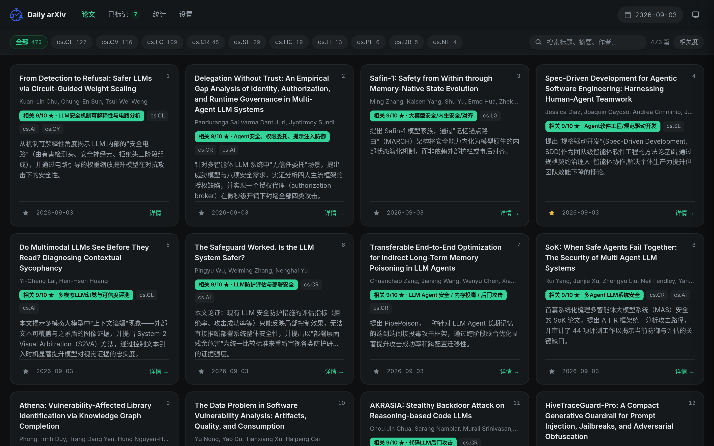

<div align="center">

# Daily arXiv AI Enhanced · 自托管版

**每天自动追 arXiv，用你自己的 Claude Code / Codex 做总结、打分、审稿。不需要任何 API key。**

**简体中文** · [English](./README.md) · [详细文档](./docs/GUIDE.zh-CN.md)

</div>

---

<div align="center">

</div>

---

## 这是什么

上游 [dw-dengwei/daily-arXiv-ai-enhanced](https://github.com/dw-dengwei/daily-arXiv-ai-enhanced)
用 GitHub Actions + 第三方 LLM API key 跑。这个分支把它改成**本机 cron + 本机 CLI**：

调用的是你已经登录好的 **Claude Code** 或 **Codex**，走你自己的订阅额度，
不需要申请任何 API key，论文数据和审稿结果全部留在你自己机器上。

| | 上游 | 本分支 |
|---|---|---|
| 运行方式 | GitHub Actions | 本机 cron |
| 模型 | DeepSeek / OpenAI API key | 你本机已登录的 Claude Code 或 Codex |
| 花费 | 按 token 付费 | 用已有订阅额度，无需 API key |
| 前端 | 多页面 | 单页应用，切换不重载 |
| 排序 | 按类别 | 按你写的研究方向打 0–10 分排序 |
| 额外功能 | — | 一键审稿、跨设备标记、研究趋势图、明暗主题 |

## 功能

### 相关性排序，而不是按类别堆

在 `ai/research_focus.txt` 里写下你的研究方向，它是打分的**唯一依据**。
每天全部论文都会拿到 0–10 分和完整五段总结；分数达标且当天靠前的，
再用最强的模型重写一遍。改完这个文件，下次跑自动生效，不用碰代码。

### 一键审稿

<div align="center">

</div>

两层：先用快模型从固定会议白名单里判定这篇最可能投哪个会（NDSS / USENIX Security /
ICSE / NeurIPS …），再按 **快速 / 正常 / 深度** 选模型，以该会议审稿人的身份给出
总体评价、优点、不足、详细意见、给作者的问题、评分、推荐、置信度。

三档差别是实打实的：同一篇论文，快模型给「小修 8/10」，中档模型给「大修 4/10」
并具体质疑到「2.6 微秒/决策低于 OPA/Rego 的典型延迟，需说明测量口径」。

### 研究趋势

<div align="center">

</div>

主方向、子方向、关键词的每日趋势。十字准线一次读出当天所有系列的数值，
图例可点开关，随时切表格视图。子方向标签是自举的——模型先查已有标签，
确实没有匹配的才新建。

### 跨设备标记 × 审稿结论

<div align="center">

</div>

标记和审稿结果存在同一个 sqlite 里，所以收藏列表直接显示推荐、评分和会议，
不用再点进去。可以只看已审稿的。

### 明暗主题 · 手机可用

<div align="center">


</div>

黑白绿配色，跟随系统或手动切换。首屏绘制前就定好主题，深色模式不会闪白。

## 快速开始

### 1. 准备 CLI（二选一）

```bash
# Claude Code —— https://claude.com/claude-code
npm i -g @anthropic-ai/claude-code && claude      # 交互式登录一次

# 或 Codex CLI —— https://developers.openai.com/codex/cli
npm i -g @openai/codex && codex login
```

登录信息在 `~/.claude` / `~/.codex`，项目直接复用，**不需要 API key**。

### 2. 装依赖

```bash
git clone https://github.com/springkill/daily-arXiv-ai-enhanced.git
cd daily-arXiv-ai-enhanced
python3 -m venv .venv && source .venv/bin/activate
pip install -e .
```

### 3. 配置

```bash
cp .env.local.example .env.local
$EDITOR .env.local                              # 改 CATEGORIES 和 LLM_PROVIDER

cp ai/research_focus.example.txt ai/research_focus.txt
$EDITOR ai/research_focus.txt                   # 写你的研究方向
```

自检 LLM 是否可用：

```bash
python3 ai/llm.py "reply with exactly: OK"
```

### 4. 跑起来

```bash
./run-local.sh                    # 爬取 → 总结 → 打标 → 出 Markdown
python3 -m http.server 8000       # 打开 http://localhost:8000
```

### 5. 后端与定时（可选）

「已标记」和「一键审稿」需要后端；不起后端其余功能照常可用。

```bash
ln -sf "$PWD/deploy/api/arxiv-api.service" ~/.config/systemd/user/
systemctl --user daemon-reload && systemctl --user enable --now arxiv-api

crontab -e
# 0 9 * * * /abs/path/to/repo/scripts/cron-wrapper.sh >> /abs/path/to/repo/logs/cron.log 2>&1
```

生产部署（nginx / docker / HTTPS / 访问控制）见 **[SELF-HOSTED.md](./SELF-HOSTED.md)**，
原理与配置详解见 **[docs/GUIDE.zh-CN.md](./docs/GUIDE.zh-CN.md)**。

## 你的数据在哪

| 路径 | 内容 | 进 git |
|---|---|---|
| `data/` | 每日 jsonl 与 Markdown | 否 |
| `var/store.sqlite3` | 标记 + 审稿结果 | 否 |
| `.env.local` | 你的配置 | 否 |
| `ai/research_focus.txt` | 你的研究方向 | 否（仓库里只有 `.example`） |
| `assets/trend-taxonomy.json` | 自举的子方向标签库 | 否（仓库里只有 `.seed`） |

**仓库里不含任何人的私人数据。** 每个人跑自己的实例、存自己的东西。

> [!CAUTION]
> 若您所在法域对学术数据有审查要求，谨慎运行本代码；任何二次分发版本必须履行合规审查
> （包括但不限于原始论文合规性、AI 合规性）义务，否则一切法律后果由下游自行承担。

---

## 贡献者

本项目的功能与代码绝大部分来自上游 [dw-dengwei/daily-arXiv-ai-enhanced](https://github.com/dw-dengwei/daily-arXiv-ai-enhanced)。
感谢以下贡献者为原项目贡献代码、发现缺陷、提出想法：

<table>
  <tbody>
    <tr>
      <td align="center" valign="top">
        <a href="https://github.com/JianGuanTHU"><br /><sub><b>JianGuanTHU</b></sub></a><br />
      </td>
      <td align="center" valign="top">
        <a href="https://github.com/Chi-hong22"><br /><sub><b>Chi-hong22</b></sub></a><br />
      </td>
      <td align="center" valign="top">
        <a href="https://github.com/chaozg"><br /><sub><b>chaozg</b></sub></a><br />
      </td>
      <td align="center" valign="top">
        <a href="https://github.com/quantum-ctrl"><br /><sub><b>quantum-ctrl</b></sub></a><br />
      </td>
      <td align="center" valign="top">
        <a href="https://github.com/Zhao2z"><br /><sub><b>Zhao2z</b></sub></a><br />
      </td>
      <td align="center" valign="top">
        <a href="https://github.com/eclipse0922"><br /><sub><b>eclipse0922</b></sub></a><br />
      </td>
    </tr>


  </tbody>
  <tbody>
   <tr>
      <td align="center" valign="top">
        <a href="https://github.com/xuemian168"><br /><sub><b>xuemian168</b></sub></a><br />
      </td>
      <td align="center" valign="top">
        <a href="https://github.com/Lrrrr549"><br /><sub><b>Lrrrr549</b></sub></a><br />
      </td>
      <td align="center" valign="top">
        <a href="https://github.com/AinzRimuru"><br /><sub><b>AinzRimuru</b></sub></a><br />
      </td>
      <td align="center" valign="top">
        <a href="https://github.com/fengxueguiren"><br /><sub><b>fengxueguiren</b></sub></a><br />
      </td>
      <td align="center" valign="top">
        <a href="https://github.com/zerocpp"><br /><sub><b>zerocpp</b></sub></a><br />
      </td>
   </tr>
  </tbody>
</table>

## 致谢

感谢以下个人与组织对原项目的推荐与支持：

<table>
  <tbody>
    <tr>
      <td align="center" valign="top">
        <a href="https://x.com/GitHub_Daily/status/1930610556731318781"><br /><sub><b>Github_Daily</b></sub></a><br />
      </td>
      <td align="center" valign="top">
        <a href="https://x.com/aigclink/status/1930897858963853746"><br /><sub><b>AIGCLINK</b></sub></a><br />
      </td>
      <td align="center" valign="top">
        <a href="https://www.ruanyifeng.com/blog/2025/06/weekly-issue-353.html"><br /><sub><b>阮一峰的网络日志 <br> 科技爱好者周刊 <br> （第 353 期）</b></sub></a><br />
      </td>
      <td align="center" valign="top">
        <a href="https://hellogithub.com/periodical/volume/111"><br /><sub><b>《HelloGitHub》<br> 月刊第 111 期</b></sub></a><br />
      </td>
    </tr>
  </tbody>
</table>

## 上游项目

- 原项目: [dw-dengwei/daily-arXiv-ai-enhanced](https://github.com/dw-dengwei/daily-arXiv-ai-enhanced)
- 路线图: https://github.com/users/dw-dengwei/projects/3

本分支只改了运行方式与前端，核心思路、爬虫与数据格式都来自上游。

## 许可

沿用上游许可证，见 [LICENSE](./LICENSE)。
